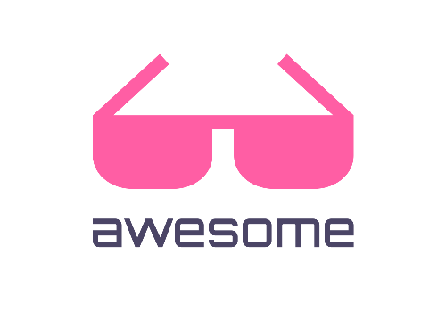

# Awesome

    
     
     
    
Coisas interessantes e úteis para estudo.

    
Material com foco em tecnologia Microsoft .NET

     

## Bibliotecas úteis

### .NET

- [Maestria Extensions Methods](https://github.com/orgs/MaestriaNet): Métodos de extensões para incrementar a produtividade em C#.
- [Humanizer](https://github.com/Humanizr/Humanizer): Manipulação de strings, enums, times, timespans, numbers e quantidades para apresentação mais legível ao ser humano.
- [FluentDateTime](https://github.com/FluentDateTime/FluentDateTime): Extensões para operações com data e hora.
- [SmartFormat](https://github.com/axuno/SmartFormat): Incremento para string.format() para suportar formatação com as propriedades de um objeto.
- [MessageFormat](https://github.com/jeffijoe/messageformat.net): Implementação .NET para ["ICU Message Format"](http://userguide.icu-project.org/formatparse/messages).
- [Flurl](https://flurl.dev/): Fluent library para HTTP e URL.
- [Hangfire](https://www.hangfire.io/): Uma maneira fácil de executar o processamento em segundo plano nos aplicativos .NET e .NET Core. Nenhum serviço do Windows ou processo separado é necessário. Aberto e gratuito para uso comercial.
- [Quartz.NET](https://www.quartz-scheduler.net/): Sistema completo de agendamento de tarefas de código aberto que pode ser usado desde os aplicativos mais pequenos até os sistemas corporativos de grande escala. Versão .NET do projeto original [Java](http://www.quartz-scheduler.org/).
- [NLog](https://nlog-project.org/): Gerador de logs com suporte a armazenamento em diferentes provedores de dados e persnalização do layout de escrita.
- [CacheManager](http://cachemanager.michaco.net/): Biblioteca poderosa para pipeline de chaches.
- [OrmLite](https://github.com/ServiceStack/ServiceStack.OrmLite): ORM leve com suporte a leitura, escrita e DDL.
- [Dapper](https://github.com/StackExchange/Dapper/tree/master): Simple object mapper.
- [Dapper.Contrib](https://github.com/StackExchange/Dapper/tree/master/Dapper.Contrib): Suporte a escrita de dados da library Dapper.
- [C# Source Generators](https://github.com/amis92/csharp-source-generators): Lista de bibliotecas para Source Generators.
  - [PrimaryConstructor](https://github.com/chaowlert/PrimaryConstructor): Source Generator para auxilar no padrão de injeção de dependência.
  - [Data Builder Generator](https://github.com/dasMulli/data-builder-generator): Geração de código builder pattern para classes de dados.
  - [SourceInject](https://github.com/giggio/sourceinject): Ao registrar classe no container de injeção de dependências Microsoft.
  - [Liversage Primitives Source Generator](https://github.com/Liversage/Primitives): Gerador de tipos primitivos para expressar o dominio.

### Angular

- [OpenID Connect](https://www.npmjs.com/package/angular-auth-oidc-client): Angular Lib para OpenID Connect & OAuth2.

### React

- [Highlighter](https://www.npmjs.com/package/react-highlight-words): Destacar parte do texto.

---

## Ferramentas

### Online

- [gitignore.io](https://www.gitignore.io): Crie arquivos .gitignore úteis para o seu projeto.
- [Stack Trace Formatter](https://elmah.io/tools/stack-trace-formatter): Formatar log de erros .NET.
- [DoFactory](https://www.dofactory.com/net/design-patterns): Consulta rápida de padrões de projetos.
- [db-engines](https://db-engines.com/en/ranking): Web site com indice de uso/popularidade dos sistema de armazenamento de dados e modelos de dados suportados.
- [Stackblitz](https://stackblitz.com): Editor de código fonte online.
- [Let's Encrypt](https://letsencrypt.org/pt-br/docs/client-options/): Autoridade certificadora gratuita, automatizada e aberta. Gere seu certificado HTTPS gratuitamente.
- [Public Api's](https://github.com/public-apis/public-apis): Lista com diversas API's públicas para uso e testes.
- [Fake Json](https://fakejson.com/): Mock JSON Api.
- [Slido](https://www.sli.do/): Plataforma de enquetes.
- [Mustache](https://mustache.github.io/): Template para configurar layout de email a ser populado com conteúdo de variáveis do sistema.

### Desktop

- [Cmder](https://cmder.net/): Emulator de terminal para windows com suporte a cmd, powershell, bash, ssh, entre outros.
- [MobaXterm](https://mobaxterm.mobatek.net/): Terminal para ambiente SSH para plataforma Windows. Possui recursos como transferência de arquivos e digitação em multiplos consoles simultâneos.
- [Terminator](https://gnometerminator.blogspot.com/p/introduction.html?m=1): Terminal para plataforma Linux com suporte a digitação em multiplos consoles simultâneos.
- [Visual Studio Code](https://code.visualstudio.com/): Ferramenta de desenvolvimento open source e versátil da Microsoft.
- [Notepad++](https://notepad-plus-plus.org/downloads/): Ferramenta de edição de arquivos e código fonte open source;
- [IL Spy](https://github.com/icsharpcode/ILSpy): .NET assembly browser and decompiler (IL and C# preview from binary).
- [NSwagStudio](https://github.com/RicoSuter/NSwag/wiki/NSwagStudio): Gerador de cliente HTTP .NET/TypeScript a partir da especificação Swagger da API.
- [ZoomIt](https://docs.microsoft.com/en-us/sysinternals/downloads/zoomit): Ferramenta de zoom e rabiscos útil para apresentações.
- [MicMute](https://sourceforge.net/projects/micmute/): App Windows para ligar/desligar microfone pelo teclado e exibir status no systray.
- [ASDF](https://asdf-vm.com/): Gerenciador de multiplas versões dos runtimes de desenvolvimento.

### Utilitários

- [OneDrive](https://github.com/abraunegg/onedrive): Client OneDrive por linha de comando compatível com Linux e Docker.

---
## Plugins

### Visual Studio Code (VSCode)

- [Project Manager](https://marketplace.visualstudio.com/items?itemName=alefragnani.project-manager): Facilitar mudança de workspace.
- [GitLens](https://marketplace.visualstudio.com/items?itemName=eamodio.gitlens): Incrementando integração com Git.
- [Numered Bookmarks](https://marketplace.visualstudio.com/items?itemName=alefragnani.numbered-bookmarks): Marcar local no código e navegar entre marcações através de atalhos numérico.
- [Bebel](https://marketplace.visualstudio.com/items?itemName=mgmcdermott.vscode-language-babel): Syntax highlighting para React JSX, Flow e GraphQL.
- [Trailing Spaces](https://marketplace.visualstudio.com/items?itemName=shardulm94.trailing-spaces): Destacar espaços em branco a direita.
- [C#](https://marketplace.visualstudio.com/items?itemName=jchannon.csharpextensions): Criar classes pelo menu de contexto e facilitadores de código.
- [dotnet](https://marketplace.visualstudio.com/items?itemName=leo-labs.dotnet): Adicionar packages do NuGet.
- [vscode-solution-explorer](https://marketplace.visualstudio.com/items?itemName=fernandoescolar.vscode-solution-explorer): Carregar solution e projetos dotnet com detalhes de packages, references, solution folders.
- [Tabnine - AI Code Completion](https://marketplace.visualstudio.com/items?itemName=TabNine.tabnine-vscode): Incrementar o auto complete.

### Visual Studio

- [IntelliSense Extender 2019](https://marketplace.visualstudio.com/items?itemName=Dreamescaper.IntellisenseExtender2019)

### Chrome

- [React Developer Tools](https://chrome.google.com/webstore/detail/react-developer-tools/fmkadmapgofadopljbjfkapdkoienihi/related?hl=en): Extensão para visualizar state React no Google Chrome.

### DBeaver

- [Extension Office](https://github.com/dbeaver/dbeaver/wiki/Extension-Office): Exportar resultado do SQL para Excel.

---

## Banco de dados

### SQL Server

- Licenças:
  - [Express](https://www.microsoft.com/pt-br/sql-server/sql-server-editions-express): Gratuita com limitações para uso comercial, verifique o comparativo entre versões para ver se não é prejudicial ao seu ambiente.
  - [Developer](https://www.cloudmotion.com.br/blog/2018/02/09/afinal-o-sql-server-developer-edition-e-de-graca/): Esta versão possui todas as features da versão entreprise, porém destina-se a uso em ambiente de testes e desenvolvimento.  Pode ser obtido gratuitamente, mas sua licença não autoriza o uso em ambiente produtivo. Possui sérias restrições de performance.
  - [Enterpise](https://www.microsoft.com/pt-br/sql-server/sql-server-2017-pricing): Versão completa do sistema para uso comercial.
  - [Comparativo](https://docs.microsoft.com/en-us/sql/sql-server/editions-and-components-of-sql-server-version-15?view=sql-server-ver15#Cross-BoxScaleLimits).
- Armazenamento multi-modelo:
  - Relacional
  - Documentos
  - Graph
- [Blitz](https://www.brentozar.com/blitz/): Pacote de store procedures para administração de banco de dados.
- [Scripts úteis](Banco%20de%20Dados/SQL%20Server/Util.sql): Coleção de scripts.

### [PostgreSQL](https://www.postgresql.org)

- Licença: Open source e livre para uso comercial.
- Armazenamento multi-modelo:
  - Relacional
  - Documentos JSON
- [PostGIS](https://postgis.net/): Extensão para adicionar suportes a objetos geográficos.
- [pg_prewarm](https://www.postgresql.org/docs/current/pgprewarm.html): Operar base de dados na memória RAM.

### [Redis](https://redis.io/)

- Licença: Open source e livre para uso comercial.
- Estrutura de dados chave/valor em memória RAM;
- Exemplos de uso:
  - Cache de dados persistidos em mecasnismos de armazenamentos lentos (Discos).
  - Message broker.
  - Compartilhamento de dados entre servidores balanceados.

---

## Big Data

### [Debezium](https://debezium.io/)

Ferramenta para stream de dados "Change Data Capture", é acoplado ao servidor de banco de dados e trabalha com os logs binários gerados pelos mesmo, notificando através do Kafka todo evento de insert/update/delete nas tabelas monitoradas.
Licença: Open Source livre para uso comercial.

### [Starburst Presto](https://www.starburstdata.com/starburst-presto-sql/)

SQL Engine para manipular várias fontes de dados em simultâneo.
Possibilita conectar em N provedores de dadso relacionais, NoSQL, arquivos, sumarizando tudo através de syntax SQL e obter a combinação de todos os dados numa única consulta.
Trabalha distribuindo o processamento em paralelo para cada fonte e unindo in memory no servidor Presto e retornando a aplicação.

---

## Infra estrutura

- [Docker](https://www.docker.com/): Virtualização de ambiente para aplicações.
- [Chocolatey](https://chocolatey.org/): Gerenciador de pacotes para windows (Semelhante ao apt-get / yum do Linux).
- [HAProxy](http://www.haproxy.org/): Balanceador de carga open source.
- [NGINX](https://www.nginx.com/): Balanceador de carga open source.
- [Kong Gateway](https://konghq.com/kong/): API gateway open source para uso em micro serviços e aplicações distribuidas.
- [Envoy](https://www.envoyproxy.io/): Balanceador de carga, proxy. Serviço executado na borda da infra. Licença open source.

---

## Workflow Engines / CI-CD

- [Wexflow](https://wexflow.github.io/): Orquestrador de fluxo de trabalho multi plataforma para manipular arquivos, executar processos, tarefas agendadas e suporte a tasks personalizadas .NET.
- [AppVeyor](https://www.appveyor.com/): CI/CD multi plataforma focado em Microsoft .NET. Possui instalação free self-hosted além da plataforma in cloud.
- [Jenkis](https://jenkins.io/): CI/CD free de ampla utilização. Instalação self-hosted.
- [Circle CI](https://circleci.com/): CI/CD in cloud. Free apenas para projetos open source.

---

## Private Cloud

- [Next Cloud](https://nextcloud.com/): Núvem privada, com web site, aplicativo multi-plataforma, suporte a deploy no docker, histórico de versões de arquivos, vários plugins oficiais e da comunidade, etc.
- [ownCloud](https://owncloud.org/): Núvem privada.
- [Wiki.JS](https://wiki.js.org/): Wiki privada open source.
- [Book Stack](https://www.bookstackapp.com/): Wiki privada open source.

---

## Web Hosts / VPS / Cloud

- [SSDNodes](https://www.ssdnodes.com/)
- [Hetzner](https://www.hetzner.com/): Serviço europeu acessível. Prós: Custo, Contra: Latência. Bom para ambientes de desenvolvimento.
- [Scaleway](https://www.scaleway.com/): Serviço europeu acessível. Prós: Custo, Contra: Latência. Bom para ambientes de desenvolvimento.

## Geração de conteúdo

- [gaGO.io](https://gago.io/): Arquitetura de software e soluções focado em .NET.
- [Edu](https://www.eduardopires.net.br/): Arquitetura empresarial focado em .NET.
- [EximiaCO.tech](https://www.eximiaco.tech/pt/thinking/): Arquitetura de software e soluções, fundamentos de computação, gestão de projetos, mundo corporativo e assuntos cotidianos.
- [OfficialMarinho/Links-uteis](https://github.com/OfficialMarinho/Links-uteis/blob/master/LINKS.md): Repositório com dicas e ferramentas diversas para desenvovledores;

### Podcasts & Canais

- [Lambda3](https://www.lambda3.com.br/lambda3-podcast/): Assuntos técnicos em geral.
- [DevShow](https://devshow.com.br/): Podcast do grupo DotNet Brasil. Principais conteúdos: .NET, Arquitetura, Docker e Micro Serviços.
- [Fábio Akita](https://www.youtube.com/user/AkitaOnRails): Empreendedor e entusiasta tecnológico falando sobre assuntos técnicos e de mercado.

### Artigos interessantes

- [SynchronizationContext and ConfigureAwait](https://devblogs.microsoft.com/dotnet/configureawait-faq/)

## Outras linguagens

### Java / Kotlin

- [Spring initialzr](https://start.spring.io/): Bootstrap application

### Go

- [Iniciação](https://go-tour-br.appspot.com/welcome/1): Tutorial de iniciação em português.
